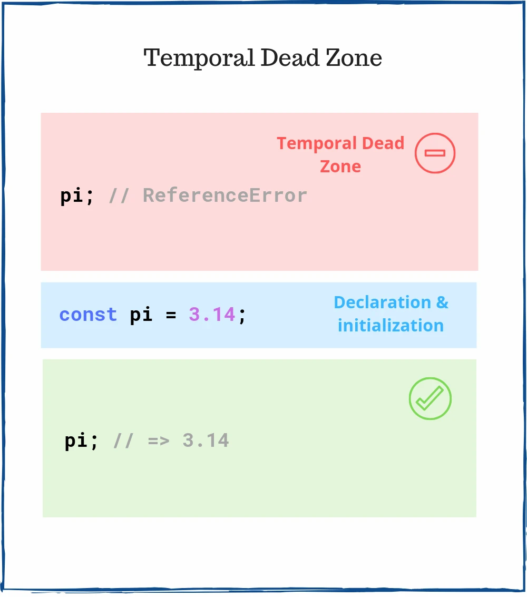

# TDZ

 

### TDZ

TDZ(Temporal Dead Zone): 일시적 사각지대, 변수가 선언되고 변수의 초기화가 이루어지기 전까지의 구간

TDZ 에서는 선언 되기 전이거나 초기화 되기 전인 상태의 변수를 사용하는 것을 허용하지 않는다. 그래서 TDZ 구간 때 선언되지 않거나 초기화 전인 변수를 참조하게 되면 에러가 발생한다.

### 자바스크립트의 변수 생성 단계

TDZ를 이해하기 위해서는 Javascript 의 변수 생성 단계를 먼저 알아야 한다.

1. 선언(Declaration): 변수를 실행 컨텍스트의 변수 객체에 등록하는 단계를 의미, 이 변수 객체는 스코프가 참조하는 대상
2. 초기화(Initialization): 실행 컨텍스트에 존재하는 변수 객체에 선언 단계의 변수를 위한 메모리를 만드는 단계, 이 단계에서 할당된 메모리에는 undefined로 초기화
3. 할당(Assignment): 사용자가 undefined로 초기화된 메모리의 다른 값을 할당

그렇기 때문에 선언과 초기화 단계가 따로 이루어 지는 let, const 같은 경우는 TDZ에 영향을 받을 수 밖에 없다.

### TDZ에 영향을 받는 것

1. let
2. const
3. class
4. class의 constructor() 내부의 super() (해당 클래스의 contructor 에서 super 함수가 호출되기 전까지는 해당 클래스에서 this 를 참조하면 에러 발생)
5. 함수 매개변수 (매개변수 선언 전에 참조하면 에러 발생)

### TDZ에 영향을 받지 않는 것

1. var
2. function (함수 선언식)
3. import (import 구문)
