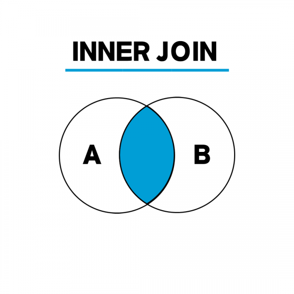
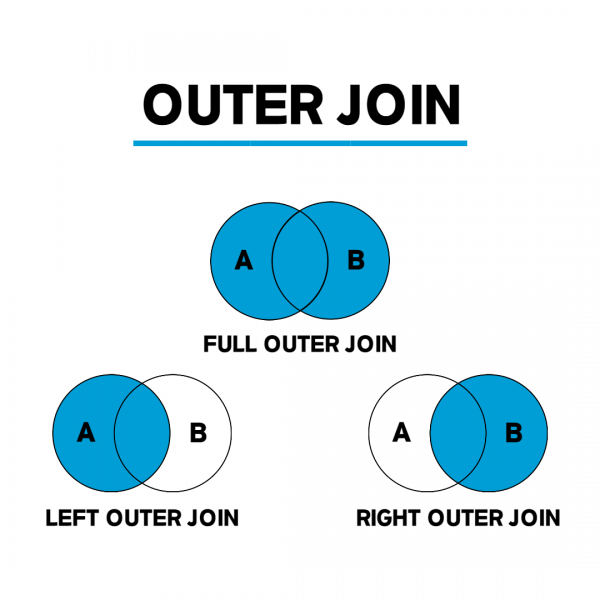
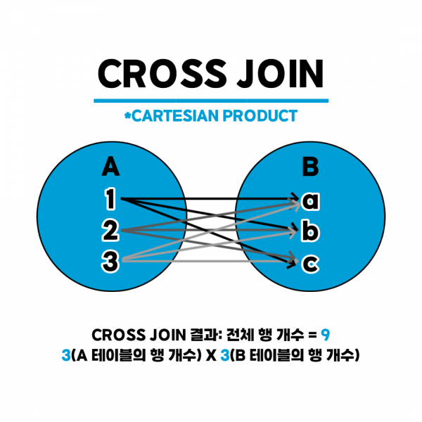
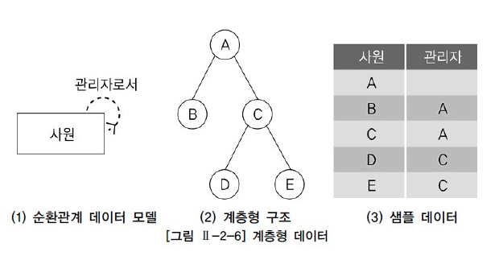
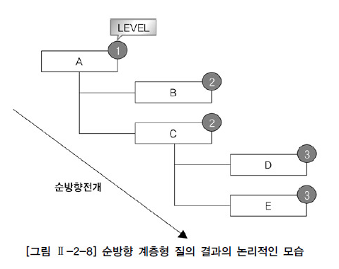

# 핵심포인트 정리

<br>

### SQL 연산순서

- FROM
- WHERE
- GROUP BY
- HAVING
- SELECT
- ORDER BY

### SQL 문법 종류

- DDL (Data Definition Language, 데이터 정의): 데이터베이스를 정의하는 언어 테이블 및 스키마 관리

  - CREATE 테이블 생성
  - ALTER 테이블의 구조 수정
  - DROP 테이블 삭제
  - RENAME 테이블 이름 변경
  - TRUNCATE 테이블 초기화

- DML (Data Manipulation Language, 데이터 조작): 데이터베이스에 입력된 데이터를 검색, 입력, 수정, 삭제

  - SELECT 데이터베이스에서 데이터 검색
  - INSERT 테이블에 데이터를 추가
  - UPDATE 테이블 내에 존재하는 데이터 수정
  - DELETE 테이블에서 데이터를 삭제

- DCL (Date Control Language, 데이터 제어): 데이터베이스에 접근하거나 객체에 권한 부여

  - GRANT 권한을 정의할때 사용
  - REVOKE 권한을 삭제할때 사용

- TCL (Transaction Control Language, 트랜잭션 제어): 데이터를 제어하는 언어가 아닌 트랜잭션을 제어할때 사용

  - COMMIT 모든 작업을 정상적으로 처리
  - ROLLBACK 모든 작업을 다시 돌려둠
  - SAVEPOINT Commit 전에 특정 시점까지만 반영하거나 Rollback

### Distinct

- 어떤 컬럼값들의 중복을 제거한 결과를 출력

다음과 같은 경우엔 col1과 col2의 값이 모두 같지 않은 것만 출력한다

```sql
SELECT Distinct col1, col2 FROM table;
```

### Alias

- 별칭 (컬럼에 임시 이름 지정)
- SELECT절에서만 사용이 가능하며 as 및 띄어쓰기로 사용할 수 있다

### concat

- 문자열 연결

```sql
SELECT col1 + col2 + col3 FROM table; -- SQL server (+)
SELECT col1 || col2 || col3 FROM table; -- oracle (||)
```

### SQL 연산자

```sql
A between B and C -- B <= A <= C
A in (1, 2, 3) -- A=1 or A=2 or A=3
A like '_ble' -- A의 값 중 2, 3, 4번째 값이 ble인 모든 데이터 출력
```

### escape

- 특수문자를 실제 문자로 인식해야할 경우, 특수문자 와일드 카드(예약어) 검색

```sql
and email like '@_%' escape '@' -- '%[문자][검색할특수문자]%' ESCAPE '[문자]'
```

- 'a%' (a로 시작하는 데이터)
- '%a' (a로 끝나는 데이터)
- '%a%' (a가 포함되는 데이터)

### rownum, top

- 특정 개수의 행만 조회

```sql
SELECT TOP 10 FROM table -- SQL server
SELECT * FROM table WHERE rownum <= 10 -- oracle
```

### null의 정의

- 모르는 값, 정의되지 않은 값 (공백이나 0과는 다름)
- 산술연산에서 null이 들어가게 된다면 null이 출력되고, 조건절에 null이 들어가게 된다면 false를 반환
- 집계함수(sum, count, min, avg...)에서 null은 데이터 대상에서 제외
- 정렬 시에는 오라클에서 가장 큰 값이 되고 SQL Server에서는 가장 작은 값이 된다

| C1  | C2   | C3   |
| --- | ---- | ---- |
| 10  | 20   | NULL |
| 15  | NULL | NULL |
| 50  | 70   | 20   |

다음과 같은 테이블이 있을 때 해당 쿼리의 값은 다음과 같다

```sql
SELECT SUM(c2) FROM table; -- 20 + 70 = 90
SELECT SUM(c1+c2+c3) FROM table; -- (10 + 20 + NULL) + (15 + NULL + NULL) + (50 + 70 + 20) = 140
SELECT SUM(c2+c3) FROM table; -- (20 + NULL) + (NULL + NULL) + (70 + 20) = 90
SELECT SUM(c2) + SUM(c3) FROM table; -- 20 + 70 + NULL = 90 + 20 + NULL = 110
```

- 컬럼 내의 SUM시 NULL값이 포함되어 있다면 NULL을 제외하고 연산 수행
- 컬럼 간의 SUM시 NULL값이 포함되어 있다면 해당 컬럼 전체가 NULL로 처리되어 연산에 포함되지 않는다

### null 처리 방법

```sql
Nvl(column, 지정값) -- column 값이 null이면 지정값을 반환
Nvl2(column, 값1, 값2) --column 값이 null이 아니면 값1을 반환하고 null이면 값2를 반환
IsNull(column, 지정값) -- column 값이 null이면 값을 반환
Nullif(값1, 값2) -- 값1과 값2가 같다면 null 반환하고 다르다면 값1 반환
COALESCE(column1, column2, column3); -- null 아닌 첫 번째 값 반환
```

### 정렬

- 느려질 수 있다
- 컬럼명으로 정렬, 앞의 기준이 같을 때는 그 다음 컬럼으로 정렬
- 기본값은 asc(오름차순), desc(내림차순)

```sql
ORDER BY a, b -- a의 값이 같을 경우 b 비교
```

### 숫자 함수

```sql
Round(숫자, 자릿수) -- 반올림
Ceil(숫자, 자릿수), Ceiling(숫자, 자릿수) -- 올림
Floor(숫자, 자릿수) -- 버림
ABS -- 절대값
GREATEST -- 최대값 (oracle의 경우 null이 존재한다면 null 반환)
LEAST -- 최소값
```

- 자릿수가 있을 경우 소숫점 아래 n째 자리까지 표시, 없다면 정수

### 문자함수

```sql
Lower -- 소문자
Upper -- 대문자
Trim, lTrim, rTrim -- 양쪽, 왼쪽, 오른쪽 공백 제거
LPAD(값, 자릿수, 채워질값), RPAD(값, 자릿수, 채워질값) -- 왼쪽, 오른쪽의 공백을 자릿수만큼 채워짐
Substr(값, 시작인덱스, 개수) -- 문자열 자르기
Instr(값, 찾을내용) -- 값 중 찾을 내용의 첫 위치 반환, 없을 시 0
```

### 날짜함수

```sql
To_char -- 날짜형 데이터를 문자로 출력
To_date -- 문자형 데이터를 날짜형으로 출력
sysdate, getdate -- 현재 날짜와 시간 가져오기 oracle, SQL Server
```

### 조건문

```sql
SELECT DECODE(컬럼명, 조건1, 결과1, 조건2, 결과2, 조건3, 결과3, ....) FROM table;
```

```sql
CASE WHEN 컬럼명, 조건1 THEN 값1 WHEN 컬럼명, 조건2 THEN 값2 ELSE 값3 END;
CASE 컬럼명 WHEN 조건1 THEN 값1 WHEN 조건2 THEN 값2 ELSE 값3 END;
```

- CASE문에서는 반드시 END가 들어가야 한다
- WHERE절에 사용 가능

### 집계함수

- count (개수), avg(평균), min(최소값), sum(합계), max(최대값)
- null은 포함되지 않는다
- 단, count(\*)의 경우에는 null도 포함한 값을 반환
- 여러 행 또는 테이블 전체 행으로부터 하나의 결과를 반환하는 함수를 뜻한다

(1, null, 2, 3, null)의 데이터를 기준으로 결과는 다음과 같다

```sql
count() -- 3
avg() -- 2
min() -- 1
sum() -- 6
max() -- 3
```

### GROUP BY

- 집약 기능을 가지고 있다 (다수의 행을 하나로 합침)
- GROUP BY절에 온 컬럼만 SELECT절에 올 수 있다

### INNER JOIN (내부 조인)

- 두 테이블을 연결할 때 가장 많이 사용한다
- 두 테이블을 조인할 때, 두 테이블에 모두 지정한 열의 데이터가 있어야 한다



```sql
SELECT 열 목록
FROM 첫 번째 테이블
INNER JOIN <두 번째 테이블>
ON 조인 조건
WHERE 검색 조건

-- 그냥 JOIN이라고 써도 INNER JOIN으로 인식한다
```

### OUTER JOIN (외부 조인)

- 두 테이블을 조인할 때, 1개의 테이블에만 데이터가 있어도 결과가 나온다
- OUTER JOIN의 종류
  - LEFT OUTER JOIN: 왼쪽 테이블의 모든 값이 출력되는 조인
  - RIGHT OUTER JOIN: 오른쪽 테이블의 모든 값이 출력되는 조인
  - FULL OUTER JOIN: 왼쪽 또는 오른쪽 테이블의 모든 값이 출력되는 조인



```sql
-- SQL server
SELECT 열 목록
FROM 첫 번째 테이블 LEFT OUTER JOIN 두 번째 테이블
ON 조인 조건

-- oracle
FROM 첫 번째 테이블, 두 번째 테이블
WHERE 첫 번째 테이블 컬럼 = 두 번째 테이클 컬럼(+)
```

### CROSS JOIN(상호 조인)

- 한쪽 테이블의 모든 행과 다른 쪽 테이블의 모든 행을 조인하는 기능
- 상호 조인 결과의 전체 행 개수는 두 테이블의 각 행의 개수를 곱한 수만큼 출력된다
- 카티션 곱(CARTESIAN PRODUCT)



```sql
SELECT *
FROM 첫 번째 테이블
CROSS JOIN 두 번째 테이블
```

### Using

- USING 절은 조인에 사용될 컬럼을 지정한다
- NATURAL 절과 USING 절은 함께 사용할 수 없다
- 조인에 이용되지 않는 동일 이름을 가진 컬럼은 컬러명 앞에 테이블명을 기술한다
- 조인 컬럼은 괄호로 묶어서 기술한다

### JOIN 순서

```sql
FROM a, b, c -- a와 b가 JOIN 되고 그리고 C와 JOIN 된다 (전체 조인 횟수: 전체 테이블 개수 -1)
```

### 서브쿼리

- 다른 쿼리 내부에 포함되어 있는 SELETE 문을 의미
- 서브쿼리 사용시 주의사항
  - 서브쿼리를 괄호로 감싸서 사용한다
  - 서브쿼리는 단일 행 또는 복수 행 비교 연산자와 함께 사용 가능하다
  - 서브쿼리에서는 ORDER BY를 사용하지 못한다
- 서브 쿼리 실행 순서
  - 서브쿼리 실행 후 메인(부모) 쿼리 실행

### 서브쿼리의 위치에 따른 명칭

- Select: 스칼라서브쿼리
- From: 인라인뷰
- Where: 중첩서브쿼리
- Having: 중첩서브쿼리
- Order by: 스칼라서브쿼리
- In: 서브쿼리출력값들 or 조건
- any/some: 서브쿼리출력값들 중 가장 작거나 큰 값과 비교
- all: any/some과 반대 개념
- Exists: 서브쿼리 내 select 절에는 뭐가 와도 상관없다 (존재여부 반환)

### 집합연산자

- UNION: 정렬 O, 중복 제거 O, 합집합, 느림
- UNION ALL: 정렬 X, 중복 제거 X, 합집합, 빠름
- INTERSECT: 정렬 O, 교칩합, 느림
- MINUS(EXCEPT): 정렬 O, 차집합, 느림

### VIEW

- 하나 이상의 기본 테이블이나 다른 뷰를 이용하여 생성되는 가상 테이블
- 장점
  - 논리적 독립성을 제공함
  - 데이터의 접근 제어 (보안)
  - 사용자의 테이터 관리 단순화
  - 여러 사용자의 다양한 데이터 요구 지원
- 단점
  - 뷰의 정의 변경 불가
  - 삽입, 삭제, 갱신 연산에 제한이 있음

### 그룹함수

- roll up
  - group by에 있는 컬럼들을 오른쪽에서 왼쪽순으로 그룹 생성
  - a, b로 묶이는 그룹의 값
  - a로 묶이는 그룹의 소계
  - 전체합계
- cube
  - 나올 수 있는 모든 경우의 수로 그룹 생성
  - a, b로 묶이는 그룹의 값
  - a로 묶이는 그룹의 소계
  - b로 묶이는 그룹의 소계
  - 전체합계
- groupingsets
- grouping

### 윈도우 함수

- 윈도우 함수에는 OVER 문구가 키워드로 필수 포함

```sql
SELECT WINDOW_FUNCTION (ARGUMENTS)
OVER ([PARTITION BY 컬럼] [ORDER BY 컬럼] [WINDOWING 절])
FROM 테이블명;
```

- WINDOW_FUNCTION: 윈도우 함수
- ARGUMENTS(인수): 함수에 따라 0 ~ N개 인수가 지정될 수 있다
- PARTITION BY 절: 전체 집합을 기준에 의해 소그룹으로 나눌 수 있다
- ORDER BY 절: 어떤 항목에 대해 순위를 지정할 지 order by 절을 기술한다
- WINDOWING 절: WINDOWING 절은 함수의 대상이 되는 행 기준의 범위를 강력하게 지정할 수 있다 (SQL server 에서는 지원하지 않음)
- RANK
  - 1, 1, 3, 4, ...
- Dense_rank
  - 1, 1, 2, 3, ...

### 계층형 질의 (Hierarchical Query)

- 테이블에 계층형 데이터가 존재하는 경우 데이터를 조회하기 위해 계층형 질의(Hierarchical Query)를 사용한다
- 엔터티를 순환관계 데이터 모델로 설계할 경우 계층형 데이터가 발생한다 (예: 조직, 사원, 메뉴 등)



```
계층형 데이터: 동일 테이블에 계층적으로 상위와 하위 데이터가 포함된 데이터
```

### Oracle 계층형 질의

- START WITH: 계층 구조 전개의 시작 위치를 지정하는 구문이다 즉, 루트데이터를 지정한다
- CONNECT BY: 다음에 전개될 자식 데이터를 지정하는 구문이다 자식 데이턴는 CONNECT BY 절에 주어진 조건을 만족해야 한다
- PRIOR: CONNECT BY 절에 사용되며, 현재 읽은 칼럼을 지정한다
- PRIOR 자식 = 부모
  - 계층구조에서 부모 ➡ 자식 방향으로 순방향 전개를 한다
- PRIOR 부모 = 자식
  - 계층구조에서 자식 ➡ 부모 방향으로 역방향 전개를 한다
- NOCYCLE: 데이터를 전개하면서 이미 나타났던 동일한 데이터가 전재 중에 다시 나타난다면 이것을 가리켜 사이클(Cycle)이 형성되었다라고 말한다 사이클이 발생한 데이터는 런타임 오류가 발생한다 하지만 NOCYCLE을 추가하면 사이클이 발생한 이후의 데이터는 전개하지 않는다
- ORDER SIBLINGS BY: 형제 노드(동일 레벨) 사이에서 정렬을 수행한다
- WHERE: 모든 전개를 수행한 후에 지정된 조건을 만족하는 데이터만 추출오라클은 계층형 질의를 사용할 때 다음과 같은 가상 칼럼(Pseudo Column)을 제공한다

### 순방향 전개

```sql
SELECT LEVEL,
LPAD(' ' , 4 * (LEVEL -1)) || EMPNO 사원,
MGR 관리자, CONNECT_BY_ISLEAF ISLEAF
FROM EMPSTART WITH MGR IS NULLCONNECT BY PRIOR EMPNO = MGR;
```

- CONNECT BY PRIOR EMPNO = MGR 이 구문은, PRIOR 사원번호 = 관리자 라는 형태이므로 순방향 전개를 펼치게 된다.
- CONNECT_BY_ISLEAF 라는 가상 칼럼을 사용하여, 해당 데이터가 리프데이터(잎노드)인지 구별하고 있다.



### 역방향 전개

```sql
SELECT LEVEL,
LPAD(' ', 4 * (LEVEL-1)) || 사원 사원,
관리자,
CONNECT_BY_ISLEAF ISLEAF
FROM 사원
START WITH 사원 = 'D'
CONNECT BY PRIOR 관리자 = 사원;
```

- 사원 'D' 로부터 자신의 상위 관리자를 찾는 역방향 전개이다.

- 역방향 전개이기 때문에 하위 데이터에서 상위 데이터로 전개된다.
- D는 루트 데이터이기 때문에 레벨이 1이며, D의 상위 데이터인 C는 레벨이 2, C의 상위 데이터인 A는 레벨 3이다.
- 리프 데이터는 A


### PL/SQL

- execption (생략 가능)
- procedule 반드시 값이 안 나옴
- trigger 커밋, 롤백 안된다
  - before, after 별로 insert, update, delete가 있다
- function 반드시 반환값이 존재한다

### 엔터티

- 관리해야 할 대상이 엔터티가 될 수 있다
- 인스턴스 2개 이상
- 업무에서 사용해야 한며 관계를 하나 이상 가져야 한다

### 엔터티의 분류

- 유형/개념/사건
- 기본/중심/행위

### 속성

- 기본
- 설계
- 파생

### 도메인

- 데이터 유형
- 크기
- 제약조건
  - check, primary key, foreign key, not null, unique ...

### 식별자

- 유일성: 유일하게 인스턴스를 구분
- 최소성: 최소 컬럼으로
- 불변성: 값이 바뀌지 않아야 한다
- 존재성: not null

위 4개의 조건을 만족하면 후보키가 될 수 있으며 그 중 하나, 대표하는 것은 기본키이다.

### 식별자/비식별자

- 식별자
  - 강한 관계
  - PK가 많아진다 (조인 시)
  - SQL이 복잡해진다
- 비식별자
  - 약한 관계
  - SQL이 느려진다

예) A라는 테이블과 B라는 테이블이 존재할 때 A에서 PK를 상속 받으면 식별관계이다 (강한 관계)

### ERD

- 그리는 방법
  - 좌상에서 우하로
  - 관계명은 반드시 표기하지 않아도 된다
  - UML은 객체지향에서만 쓰인다

### 성능 데이터 모델링

- 아키텍쳐모델링 (먼저)
  - 테이블, 파티션, 컬럼 등의 정규화 및 반정규화
- SQL 튜닝 (그 다음)
  - JOIN 수행 원리
- Hash Join
  - 등가 join만 사용한다
  - hash 함수를 사용하며 selcet, join 컬럼 저장 (선행 테이블)
  - 선행 테이블이 작다
  - hash 처리를 위한 별도 공간 필요

### NL Join

- 랜덤 엑세스
- 대용량 sort 작업
- 선행 테이블이 작을수록 유리 (모든 join이 동일)

### Sort Merge

- join 키를 기준으로 정렬
- 등가/비등가 join 가능

### Optimizer

- CBO: 가장 경재적인 것을 정함
- RBO: 규칙에 의해서 정함

### 정규화

- 제1정규화
  - 속성의 원자성을 확보
  - 기본키를 설정
- 제2정규화
  - 기본키가 2개 이상의 속성으로 이루어진 경우 부분함수 종속성 제거 (분해)
- 제3정규화

  - 기본키를 제외한 컬럼 간에 종속성 제거
  - 이행함수 종속성 제거

- Select 시 Join 때문에 느려질 수 있다 (테이블이 늘어나서)
- insert, update는 빨라질 수 있다 (테이블의 사이즈가 작아져서)

### 이상현상

- 삽입이상
- 갱신이상
- 삭제이상

### 반정규화

- 데이터의 무결성을 해칠 수 있다
- 절차
  - 대량범위처리 빈도수 조사
  - 범위처리 빈도수
  - 통계처리 여부

### List partition

- 특정값을 기준으로
- 관리가 쉽다
- 데이터가 치우칠 수 있다

### Range partition

- 특정값의 범위
- 관리가 쉽다
- 가장 많이 사용한다

### Hash partition

- 관리가 어렵다

### 분산 데이터베이스

- 데이터베이스 시스템 구축 시에 한 대의 물리적 시스템에 데이터베이스 관리 시스템을 설치하고 여러 명의 사용자가 데이터베이스 관리 시스템에 접속하여 데이터베이스를 사용하는 구조를 중앙 집중형 데이터베이스라고 한다
- 그에 반해, 물리적으로 떨어진 데이터베이스에 네트워크로 연결하여 단일 데이터베이스 이미지를 보여주고 분산된 작업 처리를 수행하는 데이터베이스를 분산 데이터 베이스라고 한다
- 분산 데이터베이스를 사용하는 고객이, 시스템이 분산되어있는지 인식하지 못하면서, 자신만의 데이터베이스를 사용하는 것 처럼 사용할 수 있다. 이처럼 데이터베이스는 투명성을 제공해야 한다

### 분산 데이터베이스의 투명성 종류

- 분할 투명성
  - 고객은 하나의 논리적 릴레이션이 여러 단편으로 분할되어 각 단편의 사본이 여러 시스템에 저장되어있음을 인식할 필요가 없다
- 위치 투명성
  - 고객이 사용하려는 데이터의 저장 장소를 명시할 필요가 없다
  - 고객은 데이터가 어느 위치에 있더라도 동일한 명령을 사용하여 데이터에 접근할 수 있어야 한다
- 지역 사상 투명성
  - 지역 DBMS와 물적 데이터베이스 사이의 사상이 보장됨에 따라 각 지역 시스템 이름과 무관한 이름이 사용가능하다
- 중복 투명성
  - 데이터베이스 객체가 여러 시스템에 중복되어 존재함에도 고객과는 무관하게 데이터의 일관성이 유지된다
- 장애 투명성
  - 데이터베이스가 분산되어 있는 각 지역의 시스템이나 통신망에 이상이 발생해도, 데이터의 무결성은 보장된다
- 병행 투명성
  - 여러 고객의 응용 프로그램이 동시에 분산 데이터베이스에 대한 트랜잭션을 수행하는 경우에도 결과에 이상이 없다

### 분산 데이터베이스의 장단점

- 장점
  - 데이터베이스 신회성과 가용성이 높다
  - 분산 데이터베이스가 병렬처리를 수행하기 때문에 빠른 응답 가능
  - 분산 데이터베이스를 추가하여 시스템 용량 확장이 쉽다
- 단점
  - 데이터베이스가 여러 네트워크를 통해서 분리되어 있기 때문에 관리와 통제가 어렵다
  - 보안관리가 어렵다
  - 데이터 무결성 관리가 어렵다
  - 데이터베이스 설계가 복잡하다

### 인덱스

- 사용 못하는 경우

  - 부정형
  - Like
  - 형변환 (묵시적)

- 악영향
  - DML 사용 시 성능이 저하된다
