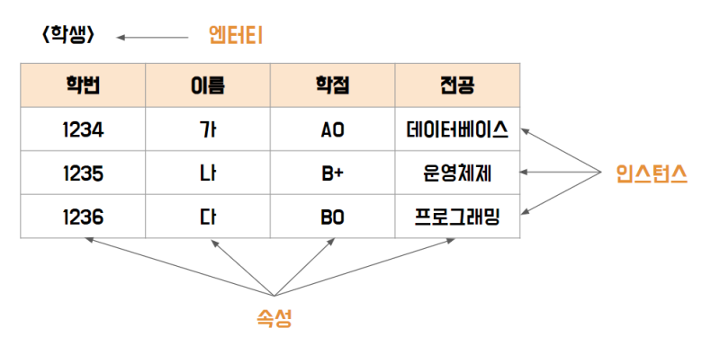

# [1과목] Part1. 데이터 모델링의 이해

 

### 모델링

현실세계를 단순화하여 표현한 것

### 모델링의 특징

-  추상화: 일정한 형식에 맞춰 간략하게 표현
-  단순화: 누구나 이해할 수 있도록 제한된 표기법이나 언어로 표현
-  명확화: 애매모호함 제거, 정확한 현상 기술

### 모델링의 세가지 관점

-  데이터 관점: 업무와 데이터 및 데이터 사이의 관계
-  프로세스 관점: 진행되고 있거나 진행되어야 하는 업무
-  상관 관점: 데이터에 대한 업무 처리 방식의 영향

### 데이터 모델링

정보 시스템 구축을 위한 데이터 관점의 업무 분석 기법

### 데이터 모델링의 목적

-  정보에 대한 표기법을 통일하여 업무 내용 분석 정확도 증대, 데이터 모델을 기초로 DB 생성

### 데이터 모델링의 기능

-  가시화, 명세화, 구조화된 틀 제공, 문서화, 다양한 관점, 구체화, 상세수준 표현

### 데이터 모델링의 중요성

-  파급효과
-  간결한 표현: 정보 요구사항과 한계를 간결하게 표현하는 도구
-  데이터 품질
   -  **유일성**(데이터 중복 저장 방지), **유연성**(데이터 정의와 데이터 사용 프로세스 분리), **일관성**

### 데이터 모델링의 3단계

(추상적) 개념적 → 논리적 → 물리적 (구체적)

-  개념적 모델링(계획분석): 핵심 엔터티 도출, ERD 작성, 업무 중심적, 포괄적, 추상화, EA수립시 사용
-  논리적 모델링(분석): KEY, 속성, 관계 표현, 재사용성 높음(정규화)
-  물리적 모델링(설계): DB 구축, 성능 및 보안 등 물리적인 성격 고려

프로젝트 생명주기: 계획 → 분석 → 설계 → 개발 → 테스트 →전환/이행 단계로 구성

### 데이터 독립성 요소

데이터 독립성 확보를 목표로 함

DB 독립성의 필요성: 데이터의 중복성과 데이터 복잡도 증가로 인한 유지보수 비용 증가 및 요구사항 대응 저하

-  외부 스키마: 사용자 관점, 각 사용자 단계의 개인적 DB 스키마
-  개념 스키마 : 조직 전체의 통합된 DB 스키마, 설계자 관점, _데이터 모델링의 지향점_
-  내부 스키마 : 물리적 장치에서 데이터가 실제적 저장, 개발자 관점

### 데이터 독립성

-  논리적 독립성 : 개념 스키마가 변경되어도 외부 스키마에 영향X, 논리적 사상X
-  물리적 독립성 : 내부 스키마가 변경되어도 외부/개념 스키마는 영향X, 물리적 사상X

### Mapping(사상)

-  상호 독립적인 개념을 연결 시켜주는 다리

### 데이터 모델링의 3요소

-  엔터티, 성격, 관계

### ERD

-  엔터티는 사각형, 관계는 마름모, 속성은 타원형으로 표현, 현실의 데이터 모두 표현 가능

### ERD 작업 순서

-  엔터티 도출
-  엔터티 배치
-  엔터티 간 관계 설정
-  관계명 기술
-  관계차수 표현: 1:1, 1:M, M:N
-  관계선택사양 표현: 필수, 선택

### 좋은 모델링의 요건

-  완전성: 업무에 필요한 모든 데이터가 정의
-  중복 배제: 하나의 DB 내에 동일한 사실은 한 번만
-  업무 규칙: 많은 규칙을 사용자가 공유하도록 제공
-  데이터 재사용: 데이터 독립적 설계
-  의사소통: 업무 규칙은 엔터티, 서브타입, 속성, 관계 등의 형태로 최대한 자세히 표현
-  통합성: 동일한 데이터는 한 번만 정의, 참조활용

---

### 엔터티 (테이블)

업무에서 관리해야 하는 데이터의 집합, 보이지 않는 개념 포함, 명사형, 인스턴스의 집합

### 속성 (컬럼)

업무에서 필요하고 관리하고자 하는 정보, 주식별자에 함수적으로 종속, 한 개의 속성은 한 개의 속성값을 가짐 (하나 이상의 속상값이면 정규화 필요)

### 인스턴스 (행)

데이터 베이스에 지정된 데이터 내용의 전체 집합

---

### 엔터티의 특징

-  반드시 해당 업무에서 필요하고 관리하고자 함
-  유일한 식별자에 의해 식별 가능
-  두 개 이상의 인스턴스의 집합
-  업무 프로세스에 의해 이용되어야 함
-  반드시 속성이 있어야 함(예외적으로 관계엔터티 경우는 주식별자 속성만 가지고 있어도 엔터티로 인정)
   다른 엔터티와 최소 1개 이상의 관계가 있어야 함(관계를 생략하여 표현해야하는 경우는 통계성 엔터티, 코드성 엔터티, 시스템 처리시 내부 필요에 의한 엔터티 도출과 같은 경우)

### 엔터티의 유무형에 따른 분류

-  유형: 물리적 형태, 안정적, 지속적 ex) 사원, 물품, 매장
-  개념: 개념적 정보, 물리적 형태X ex) 보험상품, 메뉴
-  사건: 업무 수행 시 발생, 통계자료 이용 ex) 주문, 청구, 미납

### 엔터티의 발생시점에 따른 분류

-  기본: 원래 존재하던 정보, 독립적으로 생성, 타 엔터티의 부모 역할 ex) 사원, 부서
-  중심: 기본 엔터티로부터 발생, 기본 엔터티와 행위 엔터티의 중간에 존재하는 엔터티 ex) 계약, 사고, 주문
-  행위: 2개 이상의 부모 엔터티로부터 발생, 비즈니스 프로세스를 실행하면서 생성되는 엔터티, 지속적으로 정보 추가 및 변경

### 엔터티 명명 규칙

-  현업에서 사용하는 용어 사용, 약어 금지, 단수 명사, 고유한 이름, 명확성, 유일성

### 속성 표기법

-  IE 표기법
-  Barker 표기법

### 속성의 특성에 따른 분류

-  기본: 업무로부터 추출한 모든 일반적인 속성
-  설계: 데이터 모델링 과정에서 업무 규칙화를 위해 발생하는 속성 ex) 일련번호, 코드번호
-  파생: 다른 속성에 의해 만들어지는 속성, 빠른 성능을 낼 수 있도록 원래 속성의 값을 계산 ex) 합, 평균

### 속성의 엔터티 구성방식에 따른 분류

-  기본: 엔터티를 식별할 수 있는 속성
-  외래키: 다른 엔터티와의 관계에서 포함된 속성
-  일반: 엔터티에 포함되고 PK나 FK 속성이 아닌 속성

### 도메인

속성이 가질 수 있는 값의 범위

### 관계

엔터티 간의 논리적인 관련성, 동사형, 엔터티의 인스턴스 사이의 논리적인 연관성으로서 존재의 형태로서나 행위로서 서로에게 연관성이 부여된 상태

### 관계의 패어링

엔티티 안에 인스턴스가 개별적으로 관계를 가지는 것

### UML

UML에는 연관관계와 의존관계가 있는데, 연관(존재적)관계는 항상 이용하는 관계이고 의존관계는 상대방 행위에 의해 발생하는 관계

### ERD

ERD에서는 존재적 관계와 행위에 의한 관계를 구분하지 않고 표기했지만, **UML**에서는 이를 구분하여 **연관관계는 실선, 의존관계는 점선**으로 표현

### 관계의 표기법

-  관계명
-  관계차수: 1:1(One to One), 1:M(One to Many), M:N(Many to Many(n개))
-  관계선택성(관계선택사양): 필수관계(I), 선택관계(O)

### 관계 체크사항

-  2개의 엔티티 사이에 관심있는 연관 규칙 O/X
-  2개의 엔티티 사이에 정보의 조합 발생 O/X
-  업무기술서, 장표에 관계연결에 대한 규칙 서술 O/X
-  업무기술서, 장표에 관계연결을 가능케 하는 동사 O/X

### 식별자

-  엔터티 내에서 인스턴스를 구분하는 구분자, 식별자는 논리 데이터 모델링 단계에 사용
-  key는 물리 데이터 모델링 단계에 사용

### 식별자의 특징

-  유일성
-  최소석
-  불변성
-  존재성

### 식별자의 종류

-  대표성 여부에 따른 분류

   -  주 식별자: 대표성을 만족하는 식별자, 타 엔터티와 참조관계 연결 가능
   -  보조 식별자: 어커런즈를 구분할 수 있는 구분자이나 대표성을 가지지 못해 연결 불가능

-  생성 여부

   -  내부 식별자: 스스로 생성되는 식별자
   -  외부 식별자: 다른 엔터티와의 관계를 통해 생성되는 식별자

-  속성의 수

   -  단일 식별자: 하나의 속성
   -  복합 식별자: 2개 이상의 속성으로 구성

-  대체 여부
   -  본질 식별자: 업무에 의해 만들어지는 식별자
   -  인조 식별자: 인위적으로 만든 식별자, 후보 식별자 중 주 식별자로 선정할 것이 없거나 주 식별자가 너무 많은 칼럼으로 구성되었을 때 사용

### 주식별자 도출 기준

업무에서 자주 이용되는 속성, 명칭 및 내역 등과 같이 이름으로 기술되지 않는 것, 복합 식별자 지양

### 식별자 관계

주식별자: 자식의 주식별자로 부모의 주식별자 상속

-  부모로부터 받은 식별자를 자식 엔터티의 주식별자로 이용하는 경우

비식별자: 부모 속성을 자식의 일반 속성으로 사용

-  부모 없는 자식이 생성될 수 있는 경우
-  부모와 자식의 생명주기가 다른 경우
-  여러개의 엔터티가 하나의 엔터티로 통합되어 표현되었는데 각각의 엔터티가 별도의 관계를 가진 경우
-  자식 엔터티에 별도의 주식별자를 생성하는 것이 더 유리한 경우
-  SQL 문장이 길어져 복잡성 증가되는 것 방지
   -  약한 연결관계 표현, 점선 표기
   -  자식 주식별자구성을 독립적으로 구성
